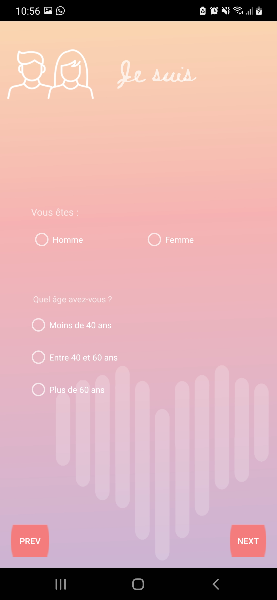

## Android Health care application
This is a clone android project for the [Fedération française de cardiologie](https://www.fedecardio.org/je-me-teste/test-3-minutes/) 
website. This project was made using java in android studio, xml for the widgets and adobe photoshope for the UI design, the assets and the color gradient 

### Home page
    This is the first page where you have to assign your name to begin your health care test

### Test question example
    This page contains two questions one for gender and another for your age the user can only chose one 
    option in each question than he can go forward for the next categorie or back to change his name.
    The user should always complete the current page questions in order to move forward. 

### Categorie page
    Once the user has finished all his questions, this page appears to give him doctor advices for each 
    categorie that he already answered.
    The categories are represented as buttons the user can click on each one to view the advice

### Advice popup 
    This is a popup that appears when a user chose a categorie to see the doctor advices.

